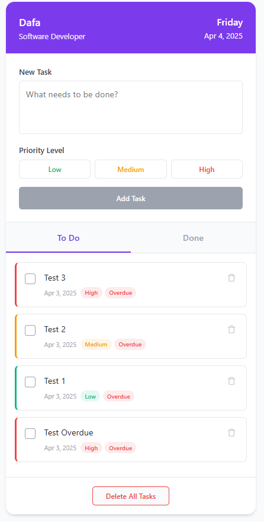

# Mobile To-Do List Application (HariSenin Mission 4)

Aplikasi To-Do List responsif untuk perangkat mobile yang membantu karyawan dalam mengelola tugas-tugas mereka secara terencana dan sistematis.



## 📋 Deskripsi

Aplikasi ini merupakan solusi manajemen tugas yang dirancang untuk membantu karyawan mengelola kegiatan harian mereka. Dengan antarmuka yang bersih dan responsif, aplikasi ini berfungsi dengan baik di berbagai perangkat, termasuk smartphone.

## ✨ Fitur Utama

- **Profil Pengguna**: Menampilkan informasi nama dan jabatan
- **Tampilan Waktu**: Menampilkan hari dan tanggal saat ini secara otomatis
- **Input Tugas**: Area teks untuk memasukkan detail tugas baru
- **Level Prioritas**: Pilihan prioritas (Low, Medium, High) dengan kode warna
- **Manajemen Tugas**:
   - Menambahkan tugas baru ke daftar
   - Menandai tugas sebagai selesai dengan checkbox
   - Menghapus tugas individual dengan tombol sampah
   - Melihat tugas yang sudah selesai di tab terpisah
   - Menghapus semua tugas sekaligus
- **Deteksi Tugas Terlambat**: Menampilkan status "Overdue" untuk tugas yang lebih dari 24 jam belum diselesaikan
- **Penyimpanan Lokal**: Data tugas dan profil pengguna tersimpan di browser

## 🛠️ Teknologi yang Digunakan

- **HTML5**: Struktur aplikasi
- **CSS3**: Styling dan desain responsif
- **JavaScript**: Logika dan interaktivitas aplikasi
- **LocalStorage API**: Penyimpanan data di browser
- **JSDoc**: Dokumentasi kode yang terstruktur

## 📁 Struktur Proyek

```
todo-app/
├── index.html          # File HTML utama
├── css/
│   └── style.css       # File CSS terpisah
├── js/
│   ├── app.js          # Logika aplikasi utama dengan JSDoc
│   └── utils.js        # Fungsi utilitas dengan JSDoc
├── docs/               # Dokumentasi JSDoc (dihasilkan)
└── jsdoc.json          # Konfigurasi JSDoc
```

## 🚀 Cara Menggunakan

1. **Clone Repositori**
   ```bash
   git clone https://github.com/username/todo-app.git
   cd todo-app
   ```

2. **Buka Aplikasi**
   - Buka file `index.html` di browser web Anda, atau
   - Gunakan server lokal:
     ```bash
     npx serve
     ```

3. **Penggunaan**
   - Saat pertama kali dibuka, aplikasi akan meminta nama dan jabatan Anda
   - Tambahkan tugas dengan mengisi teks dan memilih prioritas
   - Gunakan checkbox untuk menandai tugas yang sudah selesai
   - Gunakan tombol sampah untuk menghapus satu tugas
   - Beralih antar tab untuk melihat tugas yang aktif dan yang sudah selesai
   - Gunakan tombol Delete untuk menghapus semua tugas

## 💾 Penyimpanan Data

Aplikasi ini menggunakan localStorage browser untuk menyimpan:
- Daftar tugas
- Informasi profil pengguna

Data akan tetap tersimpan bahkan setelah browser ditutup atau direfresh.

## 📱 Tampilan Mobile

Aplikasi dioptimalkan untuk penggunaan di perangkat mobile dengan:
- Layout responsif yang menyesuaikan berbagai ukuran layar
- Elemen antarmuka yang mudah ditekan pada layar sentuh
- Tampilan fullscreen pada perangkat mobile

## 🧩 Komponen Utama

### 1. Header
- Menampilkan profil pengguna
- Menampilkan tanggal dan hari saat ini

### 2. Form Input
- Text area untuk menulis detail tugas
- Pilihan prioritas dengan kode warna
- Tombol submit untuk menambahkan tugas

### 3. Tab Navigation
- Tab "To Do" untuk tugas yang belum selesai
- Tab "Done" untuk tugas yang sudah selesai

### 4. Task List
- Daftar tugas dengan checkbox
- Tombol hapus individual untuk setiap tugas
- Indikator prioritas dengan kode warna
- Penanda tugas terlambat (overdue - 24 jam)

### 5. Footer
- Tombol Delete untuk menghapus semua tugas

## 📝 Dokumentasi dengan JSDoc

Proyek ini menggunakan JSDoc untuk mendokumentasikan kode JavaScript secara terstruktur.

### Apa itu JSDoc?

JSDoc adalah sistem dokumentasi berbasis komentar untuk JavaScript. Dengan menambahkan komentar khusus di atas fungsi dan variabel, Anda bisa menghasilkan dokumentasi yang lengkap dan terstruktur.

### Cara Menggunakan JSDoc dalam Proyek Ini

1. **Komentar JSDoc sudah Tersedia**
   - Semua fungsi dalam `utils.js` dan `app.js` telah dilengkapi dengan komentar JSDoc
   - Komentar ini memberikan informasi tentang tujuan, parameter, dan nilai pengembalian fungsi

    
3. **Menghasilkan Dokumentasi HTML**
   

   ```bash
   # Instal JSDoc
   npm install --save-dev jsdoc
   
   # Jalankan JSDoc
   npx jsdoc js -r -d docs
   ```

   - Dokumentasi yang dihasilkan akan tersedia di folder `docs/`
   - Buka `docs/index.html` di browser untuk melihat dokumentasi interaktif


4. **Konfigurasi Lanjutan**
   - Untuk konfigurasi lebih detail, buat file `jsdoc.json`:

   ```bash
   # Jalankan JSDoc dengan file konfigurasi
   npx jsdoc -c jsdoc.json
   ```

## 👨‍💻 Pengembang

Dibuat oleh **Muhammad Dafa Ardiansyah [ 15077 ]**

---

**© 2025 To-Do List App Glanze**
